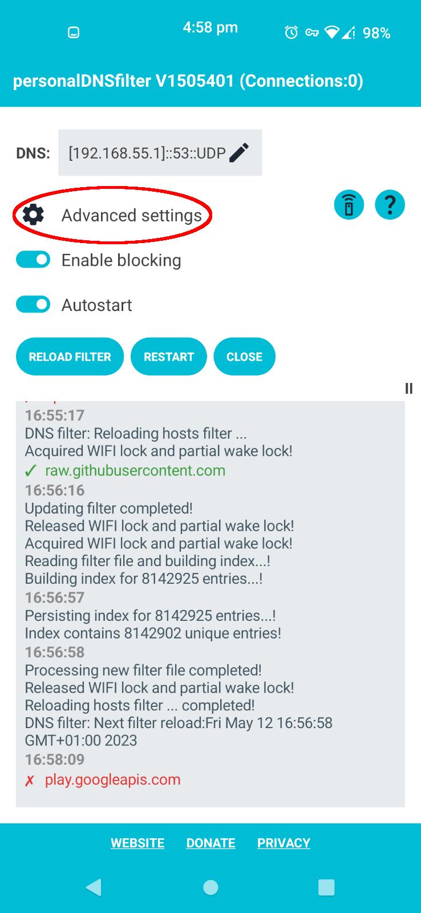
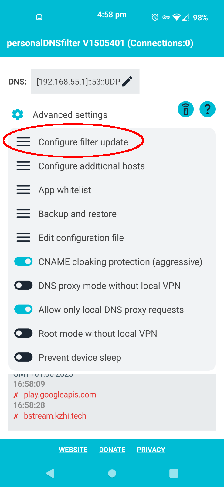
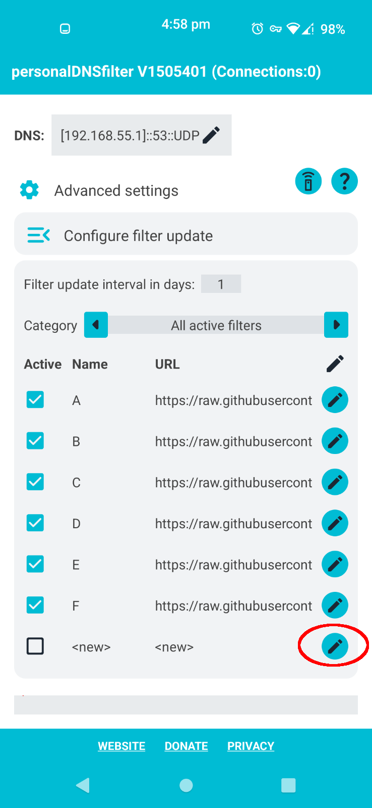
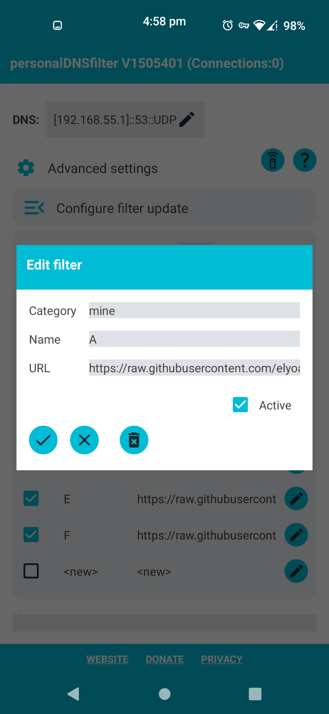
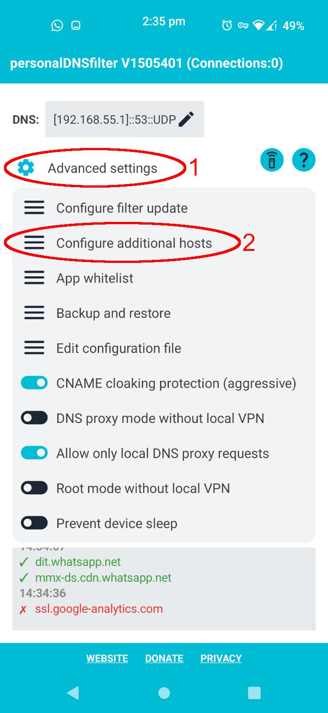
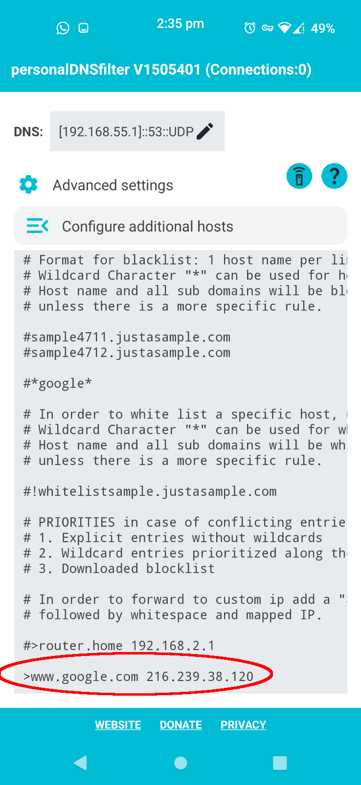
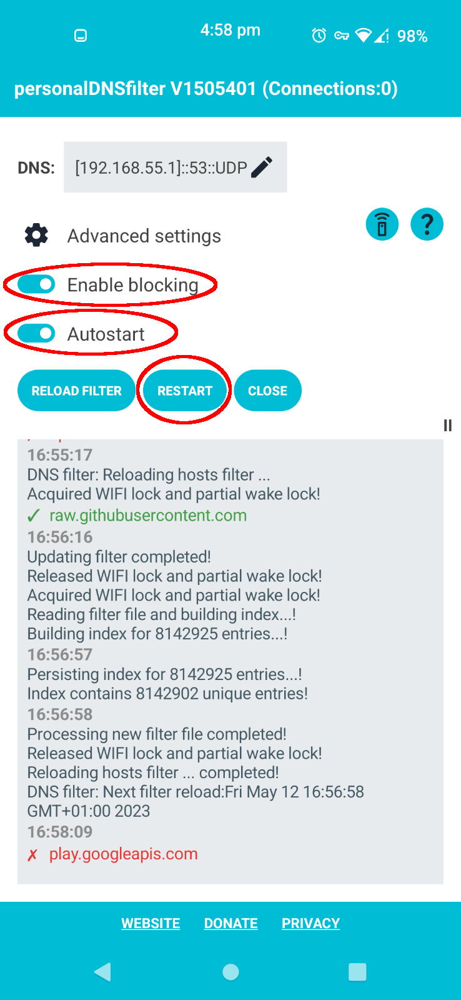

<!--
# Quick settings:
```
https://raw.githubusercontent.com/pornography-protection/filter-android/main/a

https://raw.githubusercontent.com/pornography-protection/filter-android/main/b

https://raw.githubusercontent.com/pornography-protection/filter-android/main/c
```

```
>www.google.com 216.239.38.120
```
-->

# Project info:


*«If your right eye causes you to stumble, gouge it out and throw it away. It is better for you to lose one part of your body than for your whole body to be thrown into hell. And if your right hand causes you to stumble, cut it off and throw it away. It is better for you to lose one part of your body than for your whole body to go into hell.» (Matthew 5:29-30)*

### Android Pornography DNS filter:
- An open source app which controls the information flow in and out of an Android phone, blocks ponography, evil and toxic websites in an unsophisticated way.

- How it works: It blocks known pornographic domains. Popular websites containing pornographic material aren't spared, these include: Twitter, Reddit, Instagram (focus on superficial and shallow content) and Wikipedia images. Safe search is enforced on Google while all other search engines are blocked.

- Technical note: It is a **DNS** based filter, so it is was not designed to work as a firewall.

### Install and enable [personalDNSfilter](https://github.com/ingozenz/personaldnsfilter) app on Android:
First download the app and install it:

<a href="https://f-droid.org/packages/dnsfilter.android/" target="_blank">
</a>

<a href="https://play.google.com/store/apps/details?id=dnsfilter.android" target="_blank">
</a>

Then do the following:

1. Open the app, click **'Advanced settings'**:



2. Click **'Configure filter update'**:



3. Click the edit button to add a new entry:



4. Now you need to enter the following 6 lines, each one as a separate entry in the menu:

```
https://raw.githubusercontent.com/pornography-protection/filter-android/main/a

https://raw.githubusercontent.com/pornography-protection/filter-android/main/b

https://raw.githubusercontent.com/pornography-protection/filter-android/main/c
```



5. Go back to the main menu, click **'Advanced settings'**, then **'Configure additional hosts'**:



6. Type the following line at the end, don't forget the `>` at the beginning:

`>www.google.com 216.239.38.120`



7. Finally go back (click **'Advanced settings'**) then click **'RESTART'**:



You will now have blocked pornographic domains and enforced Google safe search.

### Contact:
[sedessap@pm.me](mailto:sedessap@pm.me)

